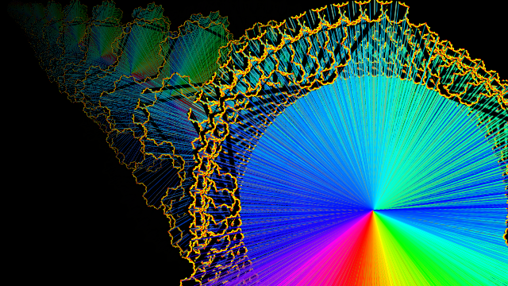
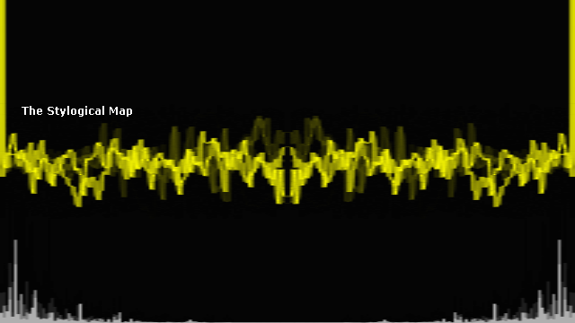

js-demos
========

These are some very loosely organized experiments, for the purpose of improving my understanding

Here's an equally loose index of what can be viewed online

[MOV16 ](http://uni-sol.org/js-demos/mov16.html) 
(output shows up in console; an emulation of an assembly MOV opperation on a 16-bit microprocessor) 

[Range2 Class ](http://uni-sol.org/js-demos/class.html) 
(based on example from 'JavaScript Pocket Reference' by D. Flanagan, 2012)

[Try 'this' ](http://uni-sol.org/js-demos/this.html) 
(comparing use of 'this' v.s. vars within methods; partially based on code from 'JavaScript Enlightenment' by C. Lindley, 2012)

[Koch Snowflake ](http://uni-sol.org/js-demos/kochflake.html) 
(expansion of example from 'Canvas Pocket Reference' by D. Flanagan, 2011)

[FFT Simple ](http://uni-sol.org/js-demos/fft-simple.html) 
(first try at music visualization using pre-analyzed fft data)

[FFT More ](http://uni-sol.org/js-demos/fft.html) 
(continues exploration of music visualization using pre-analyzed fft data)

[Visualizer (+input) ](http://uni-sol.org/js-demos/visualizer.html)
(continues exploration of music visualization, adding mouse interaction)

 

*These demos by [Revlin John ](mailto:revlin@uni-sol.org) are licensed under the [Creative Commons Attribution-ShareAlike 3.0 New Zealand License 2013 ](http://creativecommons.org/licenses/by-sa/3.0/nz/deed.en_GB)*
